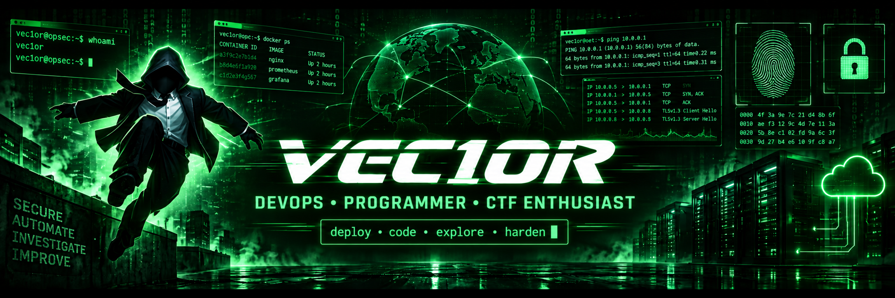

<p align="center">
  
</p>

<p align="center">
  
  
  
</p>

<p align="center">
  <a href="https://github.com/DenverCoder1/readme-typing-svg">
    
  </a>
</p>

---

<p align="center">
  
</p>

<p align="center">
  <code>🔴 🟡 🟢 &nbsp; vec1or@ops:~/lab$ ls -la</code>
</p>

<div align="center">
  
| `SYSTEM OPERATIONS` | `SECURITY LAB` |
|---|---|
| `01` Building and hardening Linux infrastructure | `01` Solving Capture The Flag challenges |
| `02` Automating routine operations | `02` Exploring cybersecurity concepts |
| `03` Deploying and configuring services | `03` Developing analytical thinking |
| `04` Creating practical software and scripts | `04` Experimenting in controlled environments |

</div>

<p align="center">
  
</p>

---

<p align="center">
  
</p>

<p align="center">
  <code>🔴 🟡 🟢 &nbsp; vec1or@ops:~/arsenal$ ls modules/</code>
</p>

<div align="center">
  
| `LANGUAGES` | `DEVOPS & INFRASTRUCTURE` | `CTF TOOLKIT` |
|:---:|:---:|:---:|
|  |  |  |
|  |  |  |
|  |  |  |
|  |  |  |
|  |  |  |
|  |  |  |
|  |  |  |
|  |  |  |

</div>

---

```diff

vec1or@ops:~$ systemctl status operator.service

● operator.service - VEC1OR Operations Environment
     Loaded: loaded
     Active: active (running)
     Tasks: development, automation, CTF
     Status: "All systems operational"

```

<p align="center">
  
</p>
